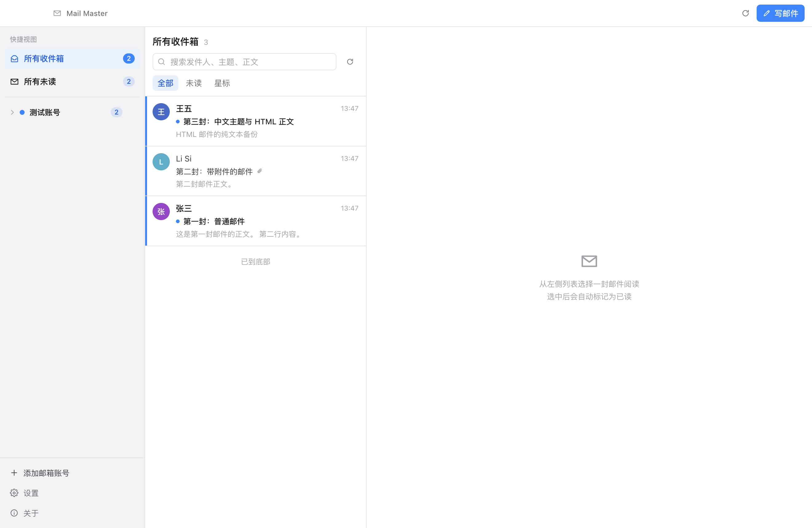
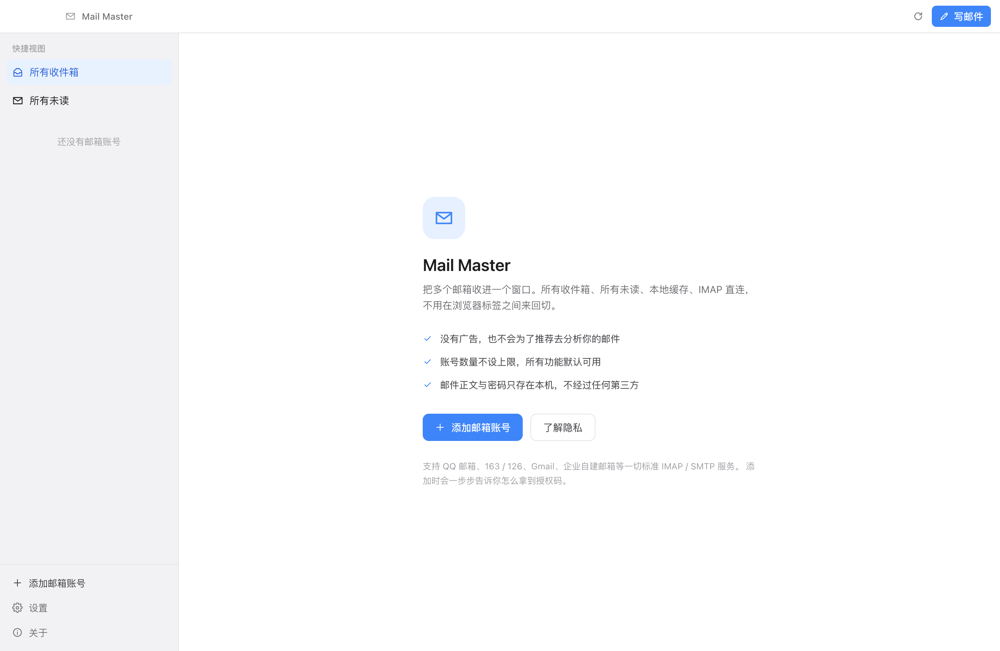
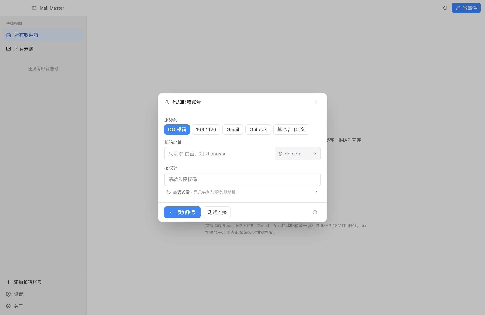
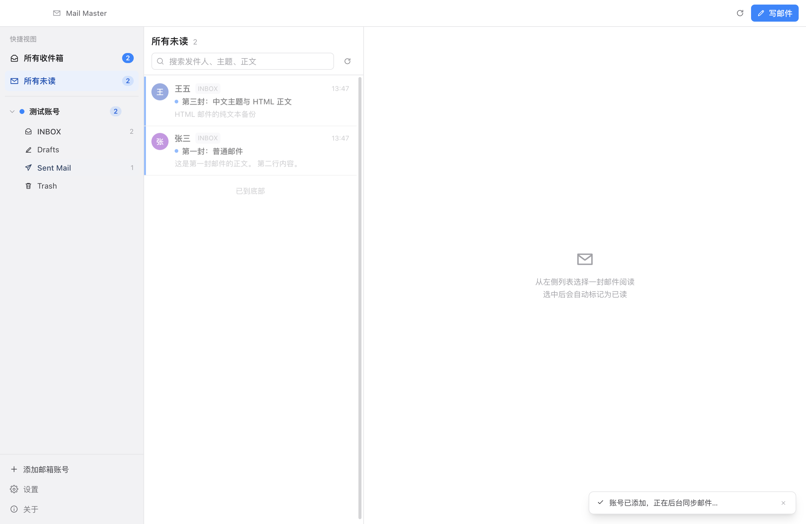
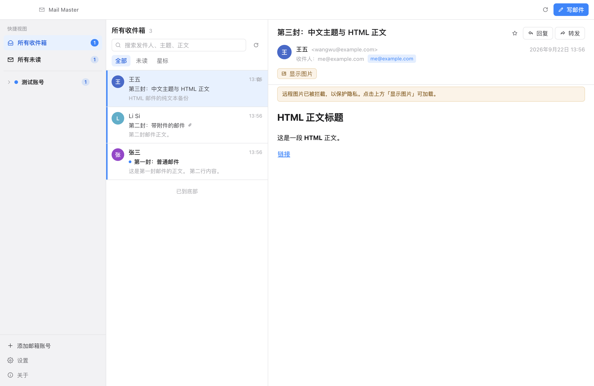
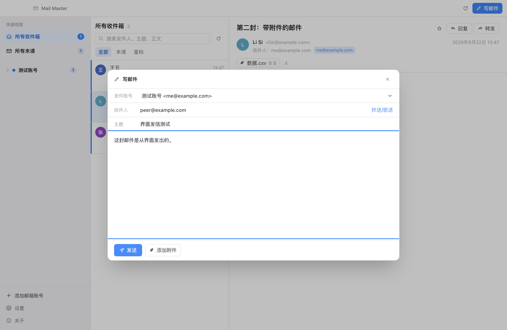
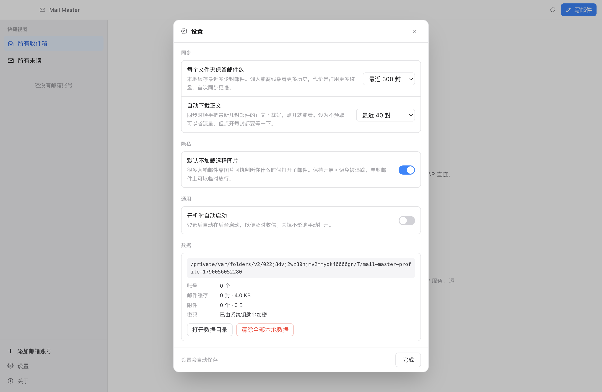

# Mail Master

macOS 多账号邮件客户端，基于 IMAP / SMTP 通用协议。把多个邮箱收进一个窗口——没有广告，不限账号，邮件只留在你的电脑上。



> 开源项目，欢迎提交 Issue 与 PR 一起把它做得更好。见[参与贡献](#参与贡献)。

## 产品承诺

这三条不是宣传语，是可以被代码和测试验证的：

- **无广告** —— 界面里没有任何广告位，也不会为了推荐去分析你的邮件。
- **不限账号** —— 账号数量不设上限，所有功能默认可用，没有会员墙。
- **数据留在本机** —— 邮件正文、附件、密码只在这台电脑与你的邮箱服务器之间流动，不经过任何第三方。没有埋点统计，没有崩溃上报，没有用户画像。

产品取舍一律遵循「降低门槛优先于增加能力」：IMAP、授权码、两步验证这些概念由界面消化掉，用户只需要照着编号步骤点。

## 功能

**添加账号（零门槛）**

- **先选服务商**（按钮组，五个选项一眼可见），再填邮箱
- 邮箱只需输入 `@` 之前的部分，域名后缀由服务商带出——多域名的服务商（QQ 的 qq.com/foxmail.com、163 的 126/yeah.net 等）后缀是一个小下拉
- 直接粘贴完整邮箱也能识别：会自动拆出域名并匹配到对应服务商
- 密码栏标签随服务商变化，直接告诉你该填「授权码」还是「应用专用密码」
- 帮助是**隐性提示**：邮箱拼完整后才出现一行「怎么拿到授权码」，点开才展开编号步骤与「打开官方页面」按钮
- 认证失败时自动展开步骤，并把错误换成醒目的红色区块
- 显示名称、登录用户名、服务器地址收在「高级设置」里，默认折叠

**收信**

- **快捷视图**：`所有收件箱`（跨账号聚合全部 INBOX）与 `所有未读`（跨账号、跨文件夹聚合未读，自动排除垃圾 / 已删除 / 草稿 / 已发送）
- 跨账号视图下每封邮件左侧色条标识来源账号，跨文件夹视图下额外标出所属文件夹
- 账号维度收件箱、任意文件夹（收件箱 / 已发送 / 草稿 / 垃圾 / 已删除 / 自定义）
- 文件夹识别同时支持 `special-use` 标记与常见中英文名称——部分服务器（如 163 的 Coremail）不上报标记，只靠标记会漏掉「已发送」
- 本地 SQLite 缓存，断网可浏览已同步内容
- IMAP IDLE 长连接，新邮件实时推送；断线自动重连（指数退避）
- 首屏同步最近 300 封邮件元数据，最近 40 封预取正文（数量可在设置中调整）

**读信**

- HTML 正文在 `sandbox` iframe 中渲染，脚本无法执行
- 远程图片默认拦截（防追踪像素），一键「显示图片」加载
- `cid:` 内联图自动转 data URL，附件自动落盘
- 附件可打开或另存为
- 打开自动标记已读，并同步 `\Seen` 到服务器

**写信**

- 多收件人 / 抄送 / 密送，附件选择
- 密送只进 SMTP 信封，不出现在报文头部
- 回复 / 转发（自动补 `Re:` / `Fwd:` 前缀并引用原文）
- 发件人显示名按 RFC 2047 正确编码

**新邮件提醒**

- **Dock 角标**：应用图标上显示未读总数
- **系统通知**：窗口不在前台时通过系统通知提醒，**点击直达那封邮件**；窗口就在眼前时只用应用内提示，不会重复打扰
- **菜单栏图标**（默认关闭，可在设置中开启）：常驻菜单栏并显示未读数，点击唤出主窗口，菜单里可快速写邮件 / 立即同步

**出问题时**

- 错误是醒目的红色区块，固定在按钮上方（滚动也一定看得见），带明确标题
- 引用服务器原话并给出下一步动作，而不是技术错误码
- 「复制诊断」抓取完整 IMAP/SMTP 协议日志，**协议级脱敏**后复制到剪贴板，可直接粘贴给他人

**设置**

- 每个文件夹保留邮件数、自动下载正文数量——直接影响磁盘占用与流量
- 默认不加载远程图片——防追踪像素，单封邮件上仍可临时放行
- 新邮件时是否发送系统通知、是否在菜单栏常驻图标
- 开机时自动启动
- 数据位置与占用统计、打开数据目录、一键清除全部本地数据（二次确认后重启）

**关于**只放只读内容：三条承诺、隐私声明、版本信息。与「设置」的分工是：关于讲「我们怎么对待你的数据」，设置放「你想怎么用它」。

**快捷键**

| 快捷键 | 功能 |
| --- | --- |
| `⌘N` | 写邮件 |
| `⌘R` | 同步全部账号 |
| `⌘,` | 打开设置 |
| `J` / `K` | 下一封 / 上一封 |
| `Esc` | 关闭弹窗 |

## 界面

<table>
  <tr>
    <td width="50%"></td>
    <td width="50%"></td>
  </tr>
  <tr>
    <td align="center">首次启动：先讲清承诺，再引导添加账号</td>
    <td align="center">添加账号：先选服务商，邮箱只填 @ 前面</td>
  </tr>
  <tr>
    <td width="50%"></td>
    <td width="50%"></td>
  </tr>
  <tr>
    <td align="center">所有未读：跨账号跨文件夹，标出来源文件夹</td>
    <td align="center">读信：HTML 渲染，远程图片默认拦截</td>
  </tr>
  <tr>
    <td width="50%"></td>
    <td width="50%"></td>
  </tr>
  <tr>
    <td align="center">写邮件：多账号选择、抄送密送、附件</td>
    <td align="center">设置：每项都真的影响运行时行为</td>
  </tr>
</table>

## 安装

### macOS

从 [Releases](https://github.com/mivolt/mail-master/releases) 下载对应的 DMG——Apple 芯片（M 系列）选 `Mail-Master-x.y.z-arm64.dmg`，Intel 芯片选 `Mail-Master-x.y.z-x64.dmg`：

1. 双击挂载，把 Mail Master 拖进 Applications
2. 首次打开若被 Gatekeeper 拦截：右键图标选「打开」，或执行
   `xattr -dr com.apple.quarantine "/Applications/Mail Master.app"`

要求 macOS 11 或更高。不确定芯片型号：「苹果菜单 → 关于本机」看「芯片」——写 Apple M 系列选 arm64，写 Intel 选 x64。

> **在 Apple 芯片上不要装 x64 版本。** macOS 26 起，运行基于 Intel 的 App 会弹出「对基于 Intel 的 App 的支持即将结束」的警告——因为 Intel 版本要通过 Rosetta 转译。确认自己装的是哪个架构：
> ```bash
> lipo -archs "/Applications/Mail Master.app/Contents/MacOS/Mail Master"   # 期望输出 arm64
> ```

### Windows

从 Releases 下载对应的安装包，双击安装。绝大多数 PC 选 `Mail-Master-x.y.z-x64-setup.exe`；Surface Pro X、骁龙笔记本等 ARM 设备选 `Mail-Master-x.y.z-arm64-setup.exe`。安装向导可以选安装目录，并会创建桌面与开始菜单快捷方式。

要求 Windows 10 或更高。

> **产物未签名**，首次运行 Windows SmartScreen 会提示「已保护你的电脑」。点「更多信息」→「仍要运行」即可。

### Linux

从 Releases 下载对应架构与格式的包（`x86_64` / `amd64` 为常见 64 位 PC，`arm64` / `aarch64` 为 ARM 设备）：

- **AppImage**（通用，免安装）：`chmod +x Mail-Master-x.y.z-x86_64.AppImage` 后直接运行。需要 FUSE（多数发行版已内置）
- **deb**（Debian / Ubuntu 及衍生版）：`sudo dpkg -i Mail-Master-x.y.z-amd64.deb`
- **rpm**（Fedora / openSUSE 等）：`sudo dnf install ./Mail-Master-x.y.z.x86_64.rpm`

要求桌面环境提供系统托盘与 libnotify（通知）。若系统没有密钥环服务（gnome-keyring / kwallet），授权码会以明文存储在本地数据库，详见「已知限制」。

## 支持的邮箱

添加账号时界面会一步步告诉你怎么拿到授权码。下表是各家的准备工作：

| 邮箱 | 准备工作 |
| --- | --- |
| QQ / Foxmail | 网页版「设置 → 账号 → POP3/IMAP/SMTP 服务」开启 IMAP/SMTP，生成 16 位授权码 |
| 163 / 126 | 网页版「设置 → POP3/SMTP/IMAP」开启服务后获取授权码 |
| Gmail | 先开启两步验证，再生成「应用专用密码」。需要本机能直连 Google |
| 企业邮箱 | 向管理员索取 IMAP/SMTP 服务器地址与端口；自签证书暂不支持 |
| Outlook / Hotmail | **个人账号已不可用**，见下方限制说明 |

服务器地址已按服务商预填，一般无需改动：

| 服务商 | IMAP | SMTP |
| --- | --- | --- |
| QQ / Foxmail | `imap.qq.com:993` SSL | `smtp.qq.com:465` SSL |
| 163 / 126 | `imap.163.com:993` SSL | `smtp.163.com:465` SSL |
| Gmail | `imap.gmail.com:993` SSL | `smtp.gmail.com:465` SSL |
| Outlook / Exchange | `outlook.office365.com:993` SSL | `smtp.office365.com:587` STARTTLS |

## 开发

```bash
npm install
npm run dev            # 开发模式（HMR）
npm run build          # 构建到 out/
npm run typecheck      # 主进程 tsc + 渲染层 vue-tsc
```

> 国内网络安装依赖时，Electron 的二进制下载可能超时，设置镜像即可：
> ```bash
> ELECTRON_MIRROR=https://npmmirror.com/mirrors/electron/ npm install
> ```
> `package-lock.json` 固定指向公网 npm 源，以保证 CI 和任何克隆者都能安装。

### 架构

```
src/
├── main/                     主进程（唯一拥有 Node 权限）
│   ├── index.ts              窗口、生命周期、单实例锁、权限拒绝
│   ├── ipc/index.ts          IPC 处理器（账号 / 邮件 / 附件 / 发信 / 设置 / 诊断）
│   ├── mail/
│   │   ├── engine.ts         每账号一个 worker：同步 + IDLE 监听 + 重连
│   │   ├── imap.ts           imapflow 封装：文件夹、信封、原文、flags
│   │   ├── smtp.ts           nodemailer 封装，非 SSL 时强制 STARTTLS
│   │   ├── parser.ts         MIME 解析 + HTML 净化 + 渲染文档生成
│   │   ├── diagnostics.ts    协议级脱敏的连接诊断报告
│   │   └── errors.ts         把 imapflow 的通用报错还原成可行动的信息
│   ├── tray.ts               菜单栏 / 任务栏图标（macOS 用模板图，Windows 用彩色图）
│   ├── badge.ts              未读角标：macOS Dock 角标 / Windows 任务栏叠加图标
│   ├── notifications.ts      新邮件系统通知
│   ├── db/                   node:sqlite（Electron 内置，无需原生编译）
│   └── security/vault.ts     safeStorage 加解密凭据（macOS 钥匙串 / Windows DPAPI）
├── preload/index.ts          contextBridge 窄接口，输出 CJS 以兼容 sandbox
├── shared/                   主/渲染共享类型、通道名、服务商预设、设置定义
└── renderer/src/             Vue 3 三栏界面
```

### 安全模型

| 边界 | 措施 |
| --- | --- |
| 渲染进程 | `sandbox: true` + `contextIsolation: true` + `nodeIntegration: false` |
| IPC | 仅通过 preload 暴露的固定方法，无任意通道调用；错误信息剥离 Electron 包装前缀 |
| 邮件正文 | `sandbox="allow-popups"` iframe + 主进程净化（剥离 script / 事件属性 / `javascript:`） |
| 远程图片 | 默认改写为占位图，原地址存 `data-blocked-src`，用户显式点击才加载 |
| 凭据 | 经系统钥匙串（macOS）/ DPAPI（Windows）加密后存 SQLite；解密失败时提示重新输入而非静默失败 |
| 诊断报告 | 按协议语义脱敏——SASL-IR 下凭据是 base64 内联的，按字面匹配密码抓不到 |
| 外链 | 一律 `shell.openExternal` 交给系统浏览器，窗口内禁止导航 |
| 权限 | `setPermissionRequestHandler` 拒绝全部（摄像头 / 定位等一概不用） |
| 传输 | TLS 1.2 起，证书默认严格校验；SMTP 非 SSL 时 `requireTLS` |

## 参与贡献

欢迎补齐功能、修 bug、改进文案。这个项目刻意保持简单，改动前建议先开 Issue 聊一下方向。

**上手路径**

1. `npm install && npm run dev`，用你自己的邮箱试着添加账号
2. 跑一遍 `npm test`，确认本地环境是绿的
3. 找一个 Issue，或自己提一个

**代码约定**

- 改完必须过 `npm test`（它会依次跑标准检查、类型检查、核心测试、集成测试）
- 改动依赖、打包配置或 CI 之后，先单独跑一次 `npm run preflight`——它把项目里
  踩过的坑固化成了可执行检查（锁文件来源、发布参数、产物命名、必需资源、
  gitignore 覆盖等），失败时会直接给出修复方式
- **提交前请阅读 [AGENTS.md](AGENTS.md)**，里面记录了产品取舍原则、界面设计原则，
  以及这个项目踩过的技术坑（imapflow 的错误包装、Vue 响应式对象过不了 contextBridge、
  弹窗的 `@click.self` 陷阱等），能省你不少时间
- 涉及界面的改动，请说明改前改后的体感差异

**提交 Issue 时**

连不上邮箱的问题，请附上应用内「复制诊断」生成的报告——它已脱敏，可直接粘贴。比描述现象有用得多。

**适合新手的入手点**

- 新增服务商预设（改 `src/shared/presets.ts` 即可，含分步引导文案）
- 补充 `scripts/` 里的测试用例
- 界面文案与英文翻译

## 测试

```bash
npm run preflight          # 标准检查：锁文件来源、发布参数、产物命名、资源、gitignore
npm run test:core          # MIME 解析 + SMTP 发信 + IMAP 同步 + 错误还原（92 项）
npm run test:integration   # 真实 Electron + 假 IMAP/SMTP 服务器走完整界面流程（115 项）
npm test                   # 上面三项 + 类型检查
```

`npm run preflight` 把项目里踩过的坑固化成了可执行检查——不遵守就会失败，
并给出修复方式。新增标准时请写成检查而不是只写在文档里。

两套自动化测试都不依赖真实邮箱账号，使用独立 `--user-data-dir`，不会污染真实应用数据。

<details>
<summary>三套测试分别覆盖什么</summary>

- `scripts/mail-tests.ts` — 用 nodemailer 的 MailComposer 生成真实 MIME 报文（含中文主题、附件、cid 内联图、script 注入、远程追踪像素），验证解析与净化；再起一个本地 TLS SMTP 服务器验证发信全链路，含密送隐私与错误密码拒绝；以及 `describeMailError()` 对 imapflow / nodemailer 各种错误形状的还原。
- `scripts/imap-tests.ts` — 起 `hoodiecrow-imap` 假服务器，验证连接、列文件夹、信封解析、BODYSTRUCTURE 附件检测、批量拉原文、flags 双向同步、认证失败识别。
- `scripts/integration.mjs` — 假 IMAP + 假 TLS SMTP 服务器 + 真实 Electron 进程，**通过界面操作**走完整「添加账号 → 同步 → 列表 → 读信 → 显示图片 → 写信发送」流程，并覆盖欢迎页、快捷视图、零门槛引导、关于与设置、一键诊断与脱敏。截图输出到 `verify/`。

</details>

### 真实邮箱实测

```bash
npm run account:setup   # 用独立 profile 打开应用，你自己添加测试邮箱
npm run test:live       # 对该账号跑完整链路实测
```

`account:setup` 打开的窗口使用 `verify/dev-profile`，与日常使用完全隔离。密码只进入 macOS 系统钥匙串，不会写入任何项目文件，也不会出现在终端输出里。

`test:live` 会验证：真实 IMAP 同步 → 文件夹与特殊用途识别 → 读信 → 星标与已读回写服务器（测完恢复原状）→ 真实服务商上的诊断报告脱敏效果 → SMTP 发信并确认收到。**测完请到邮箱设置里重置授权码。**

### 打包产物的端到端验证

打包之后不要只看「能启动」，要验证真实操作路径：

```bash
npm run verify:package                                       # 启动、版本、safeStorage、IPC 加账号
MM_TEST_EMAIL=... MM_TEST_SECRET=... \
  npm run verify:package-ui "release/mac-arm64/Mail Master.app"   # 走界面加账号 + 同步
```

这一步是必需的。曾经出现过自动化测试全绿、但打包后从界面添加账号失败的情况——原因是测试直接调 IPC 传普通对象，绕过了 Vue 响应式 Proxy 无法跨 contextBridge 的问题。

## 打包

### 自动发布（推荐）

推送 tag 即自动构建并发布，不需要本地构建环境，也不需要手动上传附件：

```bash
npm version patch        # 或 minor / major，会同时改 package.json 并打 tag
git push --follow-tags
```

`.github/workflows/release.yml` 推送 tag 后会依次执行：先做标准检查并校验 tag 与 package.json 版本一致，然后在三个平台的 runner 上并行构建（任一平台失败不影响其他平台），最后由 publish job 统一创建 Release 并上传全部附件。各平台产物：

| runner | 产物 |
| --- | --- |
| macOS | DMG × arm64 / x64，并逐一校验可执行文件架构，防止发错 |
| Windows | NSIS 安装包 × x64 / arm64 |
| Linux | AppImage / deb / rpm × x64 / arm64 |

权限来自 GitHub 自动注入的 `GITHUB_TOKEN`，**不需要配置任何 secrets**。公开仓库的 Actions 分钟数免费无限。

补发已存在的 tag（GitHub 不会为已推送的 tag 重跑 workflow）：在 Actions 页面选「发布」→ **Run workflow** → 填入版本号。

> 为什么上传附件需要 API 权限？`git push` 走 git 传输协议用 SSH 密钥，而 Release 附件走 REST API 用 token——SSH 密钥在设计上只能授权 git 传输，不能调用 API。这也是 DMG 不能走 git 推送的原因之一：它 124 MB，超过 GitHub 单文件 100 MB 的硬限制。

### 本地打包

```bash
npm run dist:mac        # macOS arm64
npm run dist:mac:x64    # macOS x64（交叉构建）
npm run dist:win        # Windows x64
npm run dist:win:arm64  # Windows on ARM（交叉构建）
npm run dist:linux      # Linux 三格式双架构（仅能在 Linux 上构建）
```

国内网络需要加镜像变量，否则 electron-builder 会在下载二进制时超时：

```bash
ELECTRON_MIRROR=https://npmmirror.com/mirrors/electron/ \
ELECTRON_BUILDER_BINARIES_MIRROR=https://npmmirror.com/mirrors/electron-builder-binaries/ \
npm run dist:mac
```

只有确实要支持 Intel Mac 时才用 `dist:mac:x64`；两个架构都出会让使用者容易装错。

Windows 目标可以在 macOS 上交叉构建（本机已验证能产出 NSIS 安装包，无需 wine）。

### 签名与公证

当前产物**未签名、未公证**，所以需要手动放行（见「安装」）。要正式分发，需要 Apple Developer 账号，并在 `electron-builder.yml` 里配置 `mac.identity` 与 `mac.notarize`（`build/entitlements.mac.plist` 已备好）。

## 已知限制

- **Outlook / Hotmail 个人账号无法登录。** 微软已于 2024 年 9 月对 `outlook.com` / `hotmail.com` / `live.com` 全面停用 IMAP 基础认证，密码或应用专用密码都会失败。这类账号需要 OAuth2 授权，当前版本未实现（界面里已给出明确提示）。企业 / 学校账号若管理员未关闭基础认证仍可用。
- **自签证书的企业邮箱无法连接。** TLS 严格校验，未提供跳过校验的开关——这是有意的，避免在无意中降级传输安全。
- **发信后不主动 APPEND 到「已发送」。** 依赖服务器自身的自动保存行为（Gmail、QQ、163 都会自动保存）。
- **搜索是本地 `LIKE` 匹配**，范围限于已同步的邮件，不是服务端全文检索。
- **草稿箱只读。** 写信过程中关闭窗口内容会丢失，尚未接入 IMAP APPEND 保存草稿。
- **未实现 OAuth2**，因此 Gmail 需应用专用密码，且账号安全策略更严格的企业邮箱可能拒绝基础认证。
- **平台支持**：macOS（已在真实邮箱上实测）；Windows 与 Linux（CI 能构建出安装包，但**尚未在真实机器上实测过运行**，需要有人帮忙验证）。Linux 还有几点平台差异：无 Dock / 任务栏角标、开机自启不可用（设置里不显示该项）、托盘图标为彩色实心图。
- **Linux 无密钥环时授权码明文存储。** 密码加密依赖系统密钥环（gnome-keyring / kwallet）；都没有时，授权码会以 `MMPLAIN1:` 前缀明文写入本地数据库——数据仍只在你电脑上、不经第三方，但请知晓这一降级。设置 → 数据里能看到当前状态。
- **移动端不做**：Electron 不支持 iOS / Android。而且 iOS 不允许后台长期保持 IMAP 连接，要做到实时推送必须引入服务器，那会违背「邮件不经过第三方」的承诺。详见下方说明。

## 技术选型说明

- **`node:sqlite` 而非 better-sqlite3** —— Electron 44 内置 Node 24 已提供 `node:sqlite`，省掉原生模块编译与 `electron-rebuild` 整个环节，安装更快、产物更简单。
- **preload 输出 CJS** —— `sandbox: true` 的 preload 不支持 ESM，因此在 `electron.vite.config.ts` 中显式指定 preload 构建为 `.cjs`。
- **TypeScript 锁定 5.9** —— TS 7 是 Go 重写版，移除了 `baseUrl` 等选项，Volar / vue-tsc 对其编译器 JS API 的兼容性尚未验证。
- **渲染侧的 `lib/plain.ts`** —— Vue 的响应式对象是 Proxy，contextBridge 无法序列化它，且失败发生在 preload 代码执行之前。所有传给 `window.api` 的对象都必须先转成普通数据。
